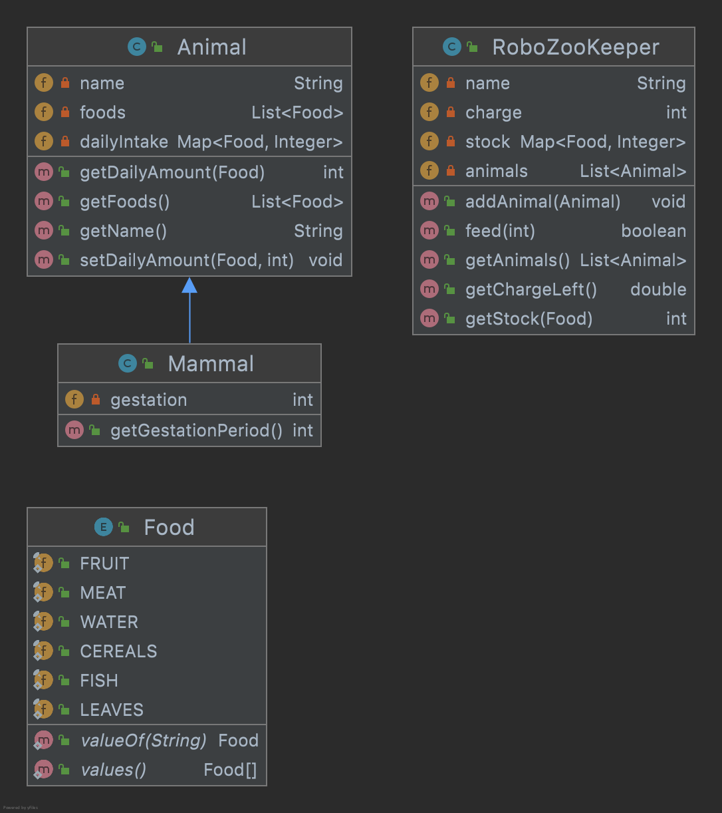

# Robo ZooKeeper
We model a Robo ZooKeeper able to feed different animals in a Zoo.

First we have the enum `Food`, which defines several food types the animals can eat. This enum is already in the project.   

### 1. class Animal
Implement class `Animal` that has a name, a list of food, and a daily amount to eat (mapping with some amount for each food in the list). 
All amounts are considered to be in grams. 
The constructor only receives the animal name and list of food; the constructor will set the amounts on 0 for all foods in the list. 

The daily intake is defined using a `setDailyAmount(Food, int)` which will be used to set the amount for each food after construction.
The getter `getDailyAmount(Food)` should return 0 if the food is not part of the recipe.

### 2. class Mammal
`Mammal` is a kind of `Animal` that can give birth to other animals. 

Add the method `getGestationPeriod()` which returns the gestation period for a `Mammal`. This is received as third argument to the constructor. 

### 3. Class RoboZooKeeper
This class will handle the feeding process. It must have a model (name), a list of `Animal` objects, and a mapping representing the stock of foods. Additionally, it has a battery capacity (in mAh (mili-Amper-hours)). 

The constructor will receive the model (name) and the battery capacity. New animals will be added using the `addAnimal(Animal)` method. The stock will be initialized having 5000 for all possible foods.  

### 4. Feeding 
Implement method `boolean feed(int x)` which feeds the animal at position x.
The method has the following behaviour:
- checks if the animal is gestating. if true, each food will be doubled.
- checks if the computed foods are available in stock 
- checks if Robo ZooKeeper has enough charge left. The battery discharges  10 mAh for each gram of food delivered.
- if the above conditions are true, then the animal is fed by updating the stock and subtracting the battery charge.  
- otherwise, the function returns false
